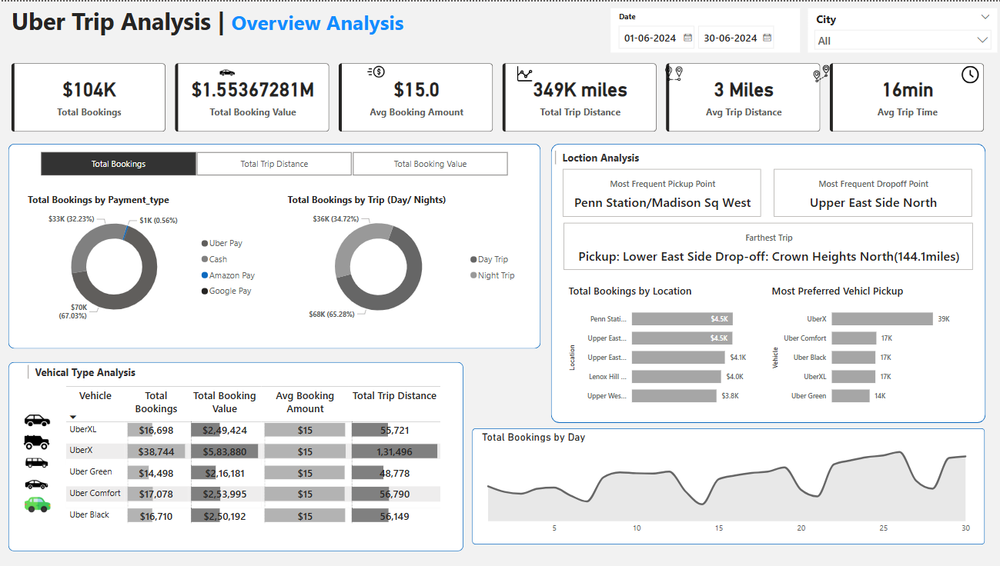
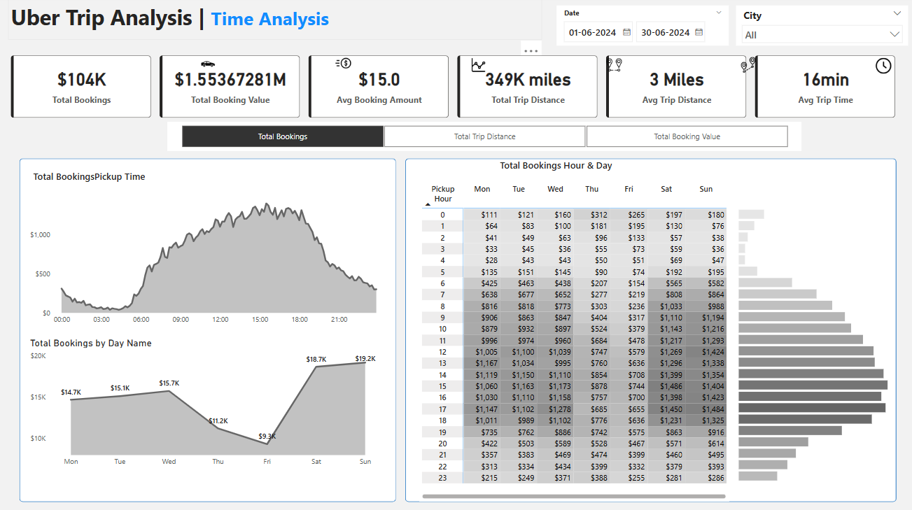

# 🚖 Uber Trip Analysis Dashboard

This project presents a comprehensive Power BI dashboard for analyzing Uber trip data collected from **01 June 2024 to 30 June 2024**. The analysis provides key business insights for decision-making in operations, vehicle optimization, and user behavior trends.

---

## 📊 Key Features

- **Total Bookings**: 104K | **Total Booking Value**: $1.55M+
- **Average Booking Value**: $15 | **Average Trip Distance**: 3 miles
- **Total Distance Covered**: 349K miles | **Average Trip Time**: 16 minutes

---

## 🔍 Dashboard Views

### 1. **Overview Analysis**
- **Payment Type Insights**: Majority use Uber Pay and Cash.
- **Trip Type**: Night Trips dominate with 65% of total bookings.
- **Popular Locations**:
  - **Pickup**: Penn Station/Madison Sq West
  - **Drop-off**: Upper East Side North
- **Most Preferred Vehicle**: UberX

  

### 2. **Time Analysis**
- Peak booking hours: **11 AM – 6 PM**
- Weekends (Sat & Sun) have the **highest total bookings**
- Hourly heatmap shows consistent demand growth from early morning to evening

---

### 3. **Trip Data Table**
- Contains detailed records of:
  - Trip ID, Time, Distance
  - Vehicle Type & Payment Method
  - Pickup Locations
  - Booking Value

  

---

## 🧰 Tools & Technologies Used

- **Power BI** for visualization and dashboard creation
- **SQL** for data cleaning and querying
- **Excel** for initial data manipulation

---

## 📈 Insights & Outcomes

- UberX is the **most booked vehicle** (38K+ bookings).
- Friday to Sunday contribute **55%+** of weekly revenue.
- High demand periods can be targeted for **surge pricing optimization**.

---

## 📂 Dataset Source

> [Uber Trip Details Data](./UberTripDetails.xlsx)

---

## 🚀 About the Creator

**Parmar Rahul**  
Final Year B.Tech (Computer Engineering)  
Aspiring Business Development Executive | Data Enthusiast  
🔗 [LinkedIn Profile](#)

---

## 📌 How to Use

1. Download `.pbix` file (if shared).
2. Open in Power BI Desktop.
3. Use filters for date or city-specific insights.

---

